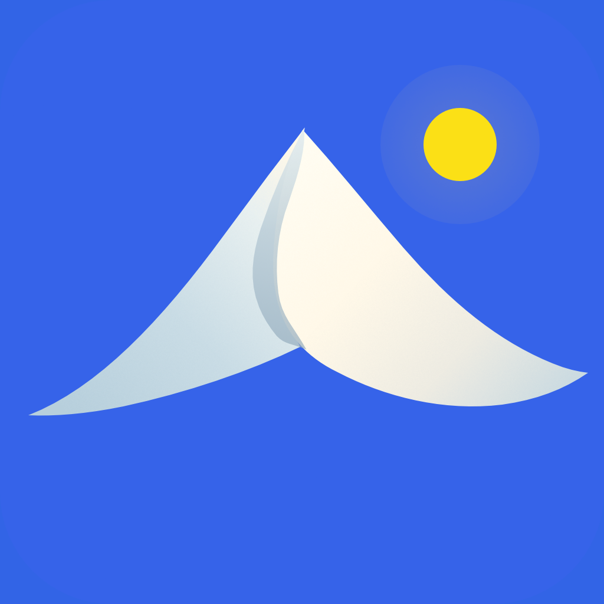

#  OpenLog

A private personal timeline for your life, on Android.

OpenLog is one quiet place for everything on your mind. A place to keep the passing details and the things that matter, without pressure to turn them into anything more.

## What it believes

Your attention is the scarcest thing you own, so OpenLog spends it carefully. There are no streaks, no badges, no notification guilt, and no algorithmic feed. Writing about your life should feel like thinking, not performing.

Your timeline belongs to you. Your content stays on your device, never uploaded to us or sold. It is yours to keep, revisit, and carry with you.

[Get OpenLog on Google Play](https://play.google.com/store/apps/details?id=share.openlog.mobile)

## Development

See [DEVELOPMENT.md](DEVELOPMENT.md) for Android setup, development commands, and checks.

## License

© Rwitesh Bera. All rights reserved.
