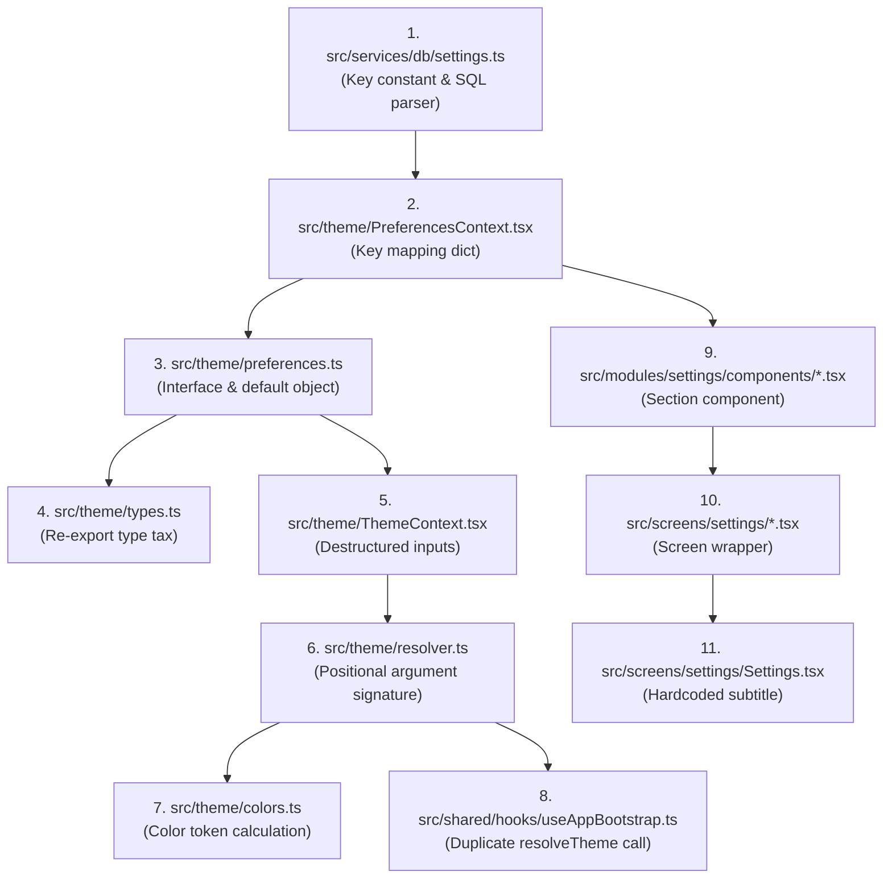
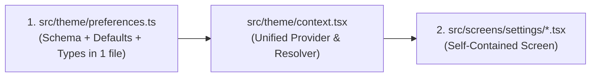

# Architecture & Maintainability Audit: Monolog

**Date:** August 20, 2026  
**Auditor:** Antigravity (Principal Software Engineer)  
**Target:** React Native 0.86 / Expo SDK 57 / React 19 / SQLite WAL  
**Purpose:** Handover document & consolidation blueprint for the next AI agent session / developer to eliminate over-subdivision, kill pass-through boilerplate, and make features effortless to maintain.

---

## 1. Executive Diagnosis: "Fractured Codebase Syndrome"

While Monolog’s UI polish and local-first SQLite performance are top-tier, the codebase suffers from **excessive fragmentation (Micro-File Fatigue & Shotgun Surgery)**.

### The Problem:
To modify, add, or delete a single simple feature (like a preference or settings item), a developer or AI agent must currently drill down **5 to 6 folder layers** and modify up to **11 separate files**.

### Why This Happened (The 4 Anti-Patterns):

1. **Micro-File Sprawl & Double-Wrapping:**
   - Empty 10-line wrapper screens (e.g. `src/screens/settings/ProfileSettings.tsx`) exist solely to import a 25-line component in another folder (`src/modules/settings/components/ProfileSection.tsx`). That is 2 files for 1 conceptual screen.
2. **Plumbing Indirection (Pass-Through Layers):**
   - Files like `AppProviders.tsx`, `theme.ts`, `types.ts`, and `primitives.tsx` contain zero business logic; they only re-export, rename, or wrap other files.
3. **Triple-Declaration of Database Keys:**
   - A single setting is declared in `src/services/db/settings.ts` (string constant), re-mapped in `src/theme/PreferencesContext.tsx` (dictionary), and defined again in `src/theme/preferences.ts` (default object).
4. **Positional Parameter Chaining:**
   - Functions like `resolveTheme(appearance, motionLevel, ...)` take explicit positional parameters instead of the unified `UserPreferences` object, breaking signatures across multiple files on any change.

---

## 2. Clean Code Principles for This Refactor

1. **Cohesion & Colocation Over Fragmentation:**
   > *"Code that changes together must live together."*
   A setting's type, default value, and DB serialization belong in **one file**, not scattered across 3 folders.
2. **Eliminate Pure Indirection:**
   If a file exists solely to pass props or re-export another file, **delete it and colocate**.
3. **Rule of Reasonable File Scope (100–250 lines):**
   A cohesive 150-line file that is easy to read and search in one view is far superior to 8 disjointed 20-line micro-files.

---

## 3. Consolidation Plan (Reducing ~25 Files to 6)

### A. Theme Subsystem: 14 Files → 3 Cohesive Files

```
CURRENT FRAGMENTED STATE (14 Files) ❌
src/theme/
├── AppProviders.tsx       (15 lines - pure pass-through wrapper)
├── ThemeContext.tsx       (100 lines)
├── PreferencesContext.tsx (250 lines)
├── preferences.ts         (70 lines)
├── resolver.ts            (90 lines)
├── theme.ts               (10 lines - deprecated re-export)
├── types.ts               (100 lines - redundant re-export barrel)
├── useThemedStyles.ts     (25 lines - unused hook)
├── primitives.tsx         (190 lines - duplicate unused text/view)
├── colors.ts              (Palettes)
├── typography.ts          (Font utilities)
├── spacing.ts             (Metrics)
├── motion.ts              (Animation tokens)
└── index.ts               (Public export)

TARGET STREAMLINED STATE (3 Cohesive Files) ✅
src/theme/
├── tokens.ts       → All design tokens in ONE place (colors, typography, spacing, motion, radius)
├── preferences.ts  → Types, defaults, and single DB schema in ONE place
└── context.tsx     → Unified Theme + Preferences provider, resolver, and hooks
```

---

### B. Settings Module: Elimination of Double-Wrapping

```
CURRENT (Double File Hopping) ❌
src/modules/settings/components/ProfileSection.tsx (Component)
  └── src/screens/settings/ProfileSettings.tsx     (10-line wrapper screen)
src/modules/settings/components/AccessibilitySection.tsx
  └── src/screens/settings/AccessibilitySettings.tsx (10-line wrapper screen)

TARGET (Single Cohesive Screens) ✅
src/screens/settings/ProfileSettings.tsx       → Contains the screen UI directly
src/screens/settings/AccessibilitySettings.tsx → Contains the screen UI directly
src/screens/settings/AppearanceSettings.tsx    → Contains appearance hub & sub-editors
```

---

## 4. Current vs Target Data Flow

### Current Flow (11 Hops):


### Target Consolidated Flow (2 Hops):


---

## 5. Next Session Action Blueprint (Step-by-Step)

The next AI agent or engineer should execute these 3 phases in order:

### Phase 1: Unify `resolveTheme` Signature (Immediate 5-minute win)
- Update `resolveTheme(preferences: UserPreferences, systemScheme: SystemScheme)` in `src/theme/resolver.ts`.
- Eliminate individual positional arguments so future preference additions/deletions never break function signatures.

### Phase 2: Delete Dead Compatibility Files
- Replace call sites importing `@/theme/theme` with `@/theme`.
- Delete `src/theme/theme.ts`.
- Delete `src/theme/primitives.tsx` (the codebase uses `src/shared/components/ThemedText.tsx`).
- Delete `src/theme/useThemedStyles.ts` (unused).

### Phase 3: Consolidate Theme & Settings Modules
- Merge `src/theme/colors.ts`, `src/theme/typography.ts`, `src/theme/spacing.ts`, `src/theme/motion.ts` into `src/theme/tokens.ts`.
- Merge `src/theme/PreferencesContext.tsx` and `src/theme/ThemeContext.tsx` into `src/theme/context.tsx`.
- Inline single-use section components from `src/modules/settings/components/` directly into their parent screens under `src/screens/settings/`.

---

## 6. Verification Checklist

- [ ] `npm run typecheck` (`tsc --noEmit`) passes with 0 errors.
- [ ] Changing or deleting any preference requires editing **only 2 files** (`src/theme/preferences.ts` and the target screen).
- [ ] No empty pass-through wrapper files remain in the codebase.
- [ ] Cold startup and SQLite WAL query times remain < 2ms.
