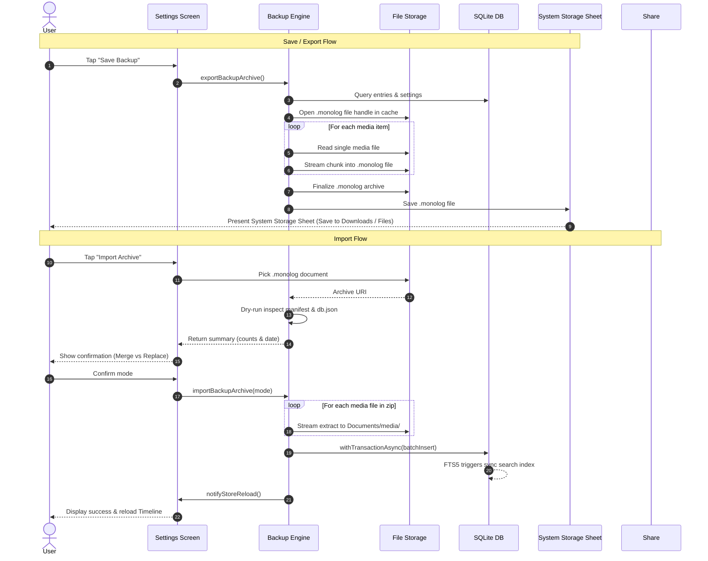

# System Design: Monolog Backup & Restore Architecture

## 1. Core Philosophy & Requirements

Monolog is a local-first, zero-cloud personal timeline. Because data lives exclusively on the user's physical device, the backup system must satisfy three non-negotiable invariants:

1. **100% Data Sovereignty:** The user owns their data in an open, inspectable format. If Monolog ceases to exist in 10 years, the user can still unzip their archive and access their text in standard JSON and their photos/recordings in standard media formats.
2. **Crash-Proof at Scale (5+ Years of Data):** A user with 10,000 entries and 2,000 photos (1–2 GB) must be able to export and restore on a mobile device without exceeding memory limits (RAM) or freezing the user interface.
3. **Zero Data Corruption:** Database restoration must be atomic. A failed or canceled import must never leave the database in a half-written or corrupted state.

---

## 2. The `.monolog` Archive Format

A `.monolog` file is a self-contained compressed package containing structured metadata, database records, and binary media assets.

```
backup-20260822-1330.monolog (ZIP Container)
│
├── manifest.json       # Archive header & integrity verification
├── db.json             # Normalized database records & user preferences
└── media/              # Binary media folder
    ├── img-1724300.jpg
    ├── audio-1724301.m4a
    └── ...
```

### Component Breakdown

| File | Purpose | Compression Strategy |
|---|---|---|
| `manifest.json` | Contains archive schema version, export timestamp, app version, entry count, and media file count for dry-run validation before import. | DEFLATE (Level 6) |
| `db.json` | Stores all entries (timestamps, text, reverse-geocoded coordinates) and user preferences. All media paths use normalized relative references (`media/<filename>`). | DEFLATE (Level 6) |
| `media/*` | Contains the actual photo attachments and voice recordings. | ZipPassThrough (Store) |

---

## 3. Key Architectural Design Choices

### A. Why a Unified Package Instead of Copying the Raw SQLite File?

1. **Media Separation:** SQLite only stores text strings (URIs). The actual images (`.jpg`) and voice notes (`.m4a`) reside in the operating system's document directory. Copying `app.db` alone would produce an empty shell where all media links are broken.
2. **iOS Container UUID Mutation:** On iOS, every app update or reinstall assigns a new UUID to the app container directory (`/var/mobile/Containers/Data/Application/<UUID>/...`). Hardcoded absolute paths in a raw database become dead links on a new device. The `.monolog` format converts all paths to portable relative references (`media/filename`) that reconnect dynamically upon restore.
3. **SQLite WAL Concurrency & Locking:** Under SQLite Write-Ahead Logging (WAL), uncommitted data lives in `-wal` and `-shm` shared memory files. Copying `app.db` while SQLite handles background tasks risks capturing a corrupted or incomplete database snapshot.

---

### B. Disk-Streaming Pipeline vs. Full-Buffer Loading (Preventing OOM)

* **The Problem:** A user with 5 years of daily journaling can accumulate 1–2 GB of photos and audio clips. Loading all binary buffers into JavaScript heap memory (`Uint8Array`) simultaneously causes immediate Out-of-Memory (OOM) app termination on mobile devices.
* **The Solution:**
  - **Export Streaming:** Media files are read in 256 KB chunks via `FileHandle.readBytes()`, piped into `fflate`'s streaming `ZipPassThrough` entries writing directly to a disk file handle, and each chunk is immediately eligible for garbage collection. Peak memory stays flat regardless of individual file size or total archive size.
  - **Import Streaming:** The compressed archive is read in 256 KB chunks via `FileHandle.readBytes()` and pushed through `fflate`'s streaming `Unzip`. Media entries stream chunk-by-chunk directly to disk via `FileHandle.writeBytes()`, bypassing in-memory buffering entirely.
  - **Inspect (Dry-Run):** Uses the same streaming `Unzip` pipeline but only processes `manifest.json` and `db.json` entries — media files are counted but never decompressed or buffered.

---

### C. Selective Compression (DEFLATE vs. Pass-Through)

* Text and metadata (`manifest.json` and `db.json`) are compressed using **DEFLATE Level 6**, reducing plain text size by 70–85%.
* Media files (`.jpg`, `.png`, `.m4a`) are already compressed natively by their respective codecs (JPEG, AAC). Re-compressing binary media with DEFLATE wastes device CPU and battery with 0% size benefit. We stream media via **Pass-Through**, maximizing speed and device thermal efficiency.

---

### D. Transactional SQLite Batching & Automatic Search Indexing

* **Single Transaction Safety:** All inserts during restoration execute inside a single SQLite transaction (`db.withTransactionAsync`). If an error occurs midway, SQLite rolls back completely, leaving existing data untouched.
* **Prepared Statement Reuse:** SQL statements (`INSERT`, `SELECT`, `UPDATE`) are prepared once via `db.prepareAsync()` and executed repeatedly with different parameter bindings per entry, avoiding per-row SQL parsing overhead. Statements are finalized in a `finally` block to prevent resource leaks.
* **FTS5 Search Sync:** Inserting entries into the primary `entries` table automatically triggers SQLite FTS5 index synchronization via native database triggers (`entries_fts_ai` / `entries_fts_au`), eliminating redundant full-text re-indexing sweeps.

---

### E. Dual Restoration Modes

Users can choose how to handle incoming archives:

1. **Merge (Non-Destructive):**
   - Compares entry IDs.
   - If an entry is missing locally, it is inserted.
   - If an entry exists, it updates only if the backup's `updatedAt` is newer.
   - Preserves all local entries that do not conflict.
2. **Replace All (Clean Restore):**
   - Atomically clears existing local entries.
   - Restores the exact database snapshot and preferences from the archive.

---

### F. Security & Privacy Guardrails

1. **Path Traversal Protection (Zip-Slip Prevention):** Every filename in the archive is sanitized through regex filters to eliminate directory traversal sequences (`../`, `/`, `\`) before creating files on disk.
2. **Dry-Run Archive Inspection:** When a file is selected, Monolog parses the manifest and database header in isolation, displaying archive date, entry count, and media count for explicit user confirmation before touching app storage.
3. **Sanitized Error Boundaries:** User-facing alerts present clear, non-technical recovery advice. Internal file paths and SQLite exceptions are never exposed to the UI and are logged only to dev diagnostics.
4. **Environment Isolation (Expo Go vs. Native Builds):** In development clients and production builds, local notifications inform the user upon completion. In Expo Go, notification modules are lazily bypassed to prevent Android SDK 53+ restriction warnings.

---

## 4. Export & Import Execution Flow


