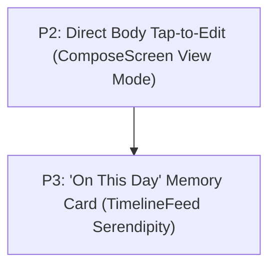

# OpenLog Master System Architecture, Psychology & Roadmap

**Target Audience:** Engineers, AI Agents, and Product Designers working on `openlog`.  
**Status:** Canonical Living Document  
**Date:** August 2026  

---

## 1. Executive Context & Core Philosophy

`openlog` is a personal writing and autobiographical timeline system built on React Native & Expo. It operates under psychological constraints fundamentally different from productivity suites or social media platforms:

$$\text{Human Intention} > \text{Writing} > \text{Reflection} > \text{Timeline/History} > \text{Organization} > \text{Engagement}$$

### Foundational Tenets
1. **Rejection of Extrinsic Gamification:** No guilt-inducing streaks, artificial push notifications, vanity badges, or algorithmic engagement traps.
2. **Local-First & Private:** Instant local SQLite transactions, encrypted offline storage, and zero telemetry on personal writing content.
3. **Calm Software:** Every micro-transition, spatial layout, typography choice, and color value must protect the user's attention from sensory fatigue.
4. **Engineering Principles (`AGENTS.md`):**
   - **Two-File Rule:** Modifying or adding a feature touches at most 2 files (domain definition + screen UI).
   - **Cohesion & Colocation:** 100–300 line files; no single-use wrapper components or pass-through indirection.
   - **Strict Type Safety:** `npm run typecheck` (`tsc --noEmit`) must always pass with **0 errors**. Zero use of `any`.
   - **Biome Cleanliness:** All code must pass Biome linting and formatting without warnings.

---

## 2. The Cognitive Psychology & Attention Architecture

Working memory during introspective states has an extremely limited bandwidth (~3 to 4 items per Cowan’s model). Visual and semantic noise competes directly with fragile inner thoughts.

```
┌─────────────────────────────────────────────────────────────┐
│                 COGNITIVE LOAD DISTRIBUTION                 │
├───────────────────┬─────────────────────────────────────────┤
│ Intrinsic Load    │ Translating raw feelings into language. │
│ (Preserve)        │ Recalling autobiographical memories.    │
├───────────────────┼─────────────────────────────────────────┤
│ Extraneous Load   │ Deciding whether to tap "Edit" vs View. │
│ (Eliminate)       │ Parsing wallpapers behind text.         │
│                   │ Managing complex modals or forms.       │
├───────────────────┼─────────────────────────────────────────┤
│ Germane Load      │ Connecting a present realization to a   │
│ (Foster)          │ past moment on the timeline rail.       │
└───────────────────┴─────────────────────────────────────────┘
```

### The Attention Budget Matrix

| Category | Definition | Interface Elements | Psychological Treatment |
| :--- | :--- | :--- | :--- |
| **Essential** | Non-negotiable elements for the primary mental task. | • Empty writing canvas<br>• Save action button<br>• Chronological timeline rail & feed | Zero visual competition. Unobstructed focus. |
| **Helpful** | Elements providing spatial and temporal orientation. | • Continuous vertical rail connector<br>• Subtle date & time stamps<br>• Calendar jump-picker | Low-contrast, quiet, peripheral placement. |
| **Optional** | Secondary retrospective context. | • Geocoded location tag<br>• Photo/audio attachments | Disclosed progressively; zero friction on writing. |
| **Distracting** | Visual/semantic noise that displaces working memory. | • Full-bleed background wallpapers<br>• High-contrast notification badges<br>• Aggressive interrogative prompts | **Eliminated.** Removed from the core reading path. |

---

## 3. The Neurobiology of Colors & Theme Psychology

### A. Dopamine vs. Serotonin Architecture
* **The Social Media / Anxiety Trap (Dopaminergic UI):** Platforms like Instagram, X, and TikTok use pure black OLED canvases paired with high-saturation crimson notification dots (`#EF4444`). This triggers the amygdala, spikes cortisol, and creates an addictive, vigilance-driven loop of checking for external validation.
* **OpenLog Sanctuary (Serotonergic UI):** OpenLog explicitly rejects red/orange alert loops. The interface uses warm, organic, grounding tones that stimulate parasympathetic relaxation, lowering heart rate and encouraging deep, self-compassionate reflection.

### B. Circadian Rhythms & Melatonin Preservation
Autobiographical writing happens disproportionately in two mental states:
1. **Morning Awakening (06:00 – 09:30):** High cognitive freshness, intention-setting. Demands a clean, tactile writing page.
2. **Evening Decompression (20:30 – 23:30):** Vulnerability, reflection, memory consolidation. Standard "cold steel" dark modes (`#121215`) emit short-wavelength blue spectrum light that suppresses melatonin and signals daytime work/stress.
   * **The Solution — "Nocturne Warm Dark" (`#141312`):** A warm espresso obsidian canvas that eliminates blue-light glare and feels like a dimly lit study with aged wood and warm paper.

### C. Attention Hierarchy & The Von Restorff (Isolation) Effect
In autobiographical writing, chromatic intensity must strictly adhere to the Attention Budget Matrix:
* **The Temporal Spine (The Primary Chromatic Anchor):**
  * 🔵 **Signature Mood Accent (`colors.marker` / `colors.accent`):** Reserved exclusively for the **Timeline Rail Date Markers** and primary action buttons. This grounds the autobiographical thread in time without competing with the writing.
* **Calm Structural Micro-Anchors (Zero Saturated Competition):**
  * 📍 **Geolocation (`textTertiary` pin icon + `textSecondary` place name):** Provides pre-attentive spatial context ($<100\text{ms}$) without turning the feed into a loud travel check-in badge.
  * 🎙️ **Voice Memos & Audio (`surfaceMuted` card + accent play button):** Tactile hardware aesthetic with a focused accent play trigger, avoiding distracting saturated card fills.
  * 🖼️ **Media Attachments (Hairline framed viewports):** Clean separation on canvas without synthetic color tags.

### D. Why Background Wallpapers Were Removed
1. **Glyph Collision & Eye Strain:** A journal is 95% typography. Even at 20% opacity, photographic textures (branches, clouds, shadows) introduce high-frequency visual noise that collides with letter stems, causing subconscious eye fatigue within 30 seconds of reading.
2. **120Hz Hardware Performance:** Eliminating `<Image style={StyleSheet.absoluteFill} />` removes full-screen GPU alpha-blending overdraw on every scroll frame, delivering butter-smooth scrolling across budget and flagship Android devices.
3. **Bundle Efficiency:** Removed 10 bundled JPEG assets (`assets/backgrounds/`), instantly shaving APK download size.

---

## 4. Theme & Color Specifications

The system is defined centrally in [`src/theme/tokens.ts`](file:///Users/rwitesh/Work/openlog/src/theme/tokens.ts) and consumes no external stylesheets.

### Base Atmospheres

| Token | Light: **Washi Linen** | Dark: **Nocturne Warm** | Rationale |
| :--- | :--- | :--- | :--- |
| `background` | `#FAF7F2` | `#141312` | Warm milk paper vs. Rich espresso obsidian |
| `surface` | `#FFFFFF` | `#1C1A18` | Clean paper page vs. Cocoa slate |
| `surfaceMuted`| `#F3EDE2` | `#272421` | Soft oatmeal vs. Muted coffee stone |
| `text` | `#1B1816` (15.2:1 AAA) | `#F5F1EB` (16.8:1 AAA) | Sumi charcoal ink vs. Soft linen white |
| `textSecondary`| `#686054` (4.7:1 AA) | `#A49C90` (7.2:1 AAA) | Raw umber vs. Warm driftwood parchment |
| `textTertiary` | `#988E80` | `#6E675C` | Subtle placeholders, quiet metadata |
| `line` | `#D8D0C2` | `#38332C` | Tactile notebook thread / rail line |
| `separator` | `#E6DFC8` | `#2A2621` | Hairline border dividers |
| `marker` / `accent`| `#2D5BE3` (6.2:1 AA) | `#4D7DF9` (6.8:1 AA) | Signature OpenLog Cobalt default |

### The 12 Curated Mood Accents
Users can personalize their signature mood accent in Settings:

| ID | Name | Light Color | Dark Color | Psychological Mood |
| :--- | :--- | :--- | :--- | :--- |
| `default` | **OpenLog Cobalt** | `#2D5BE3` | `#4D7DF9` | Deep focus, quiet clarity, modern craft |
| `terracotta` | **Terracotta** | `#BA4A32` | `#EC745C` | Earthy baked clay, Mediterranean warmth |
| `amber` | **Amber Honey** | `#B87514` | `#F5A738` | Sunset warmth, nostalgic golden hour |
| `sage` | **Botanical Sage**| `#38734C` | `#65B880` | Forest calm, morning mist, steady grounding |
| `rose` | **Dusty Rose** | `#B03A62` | `#F06E98` | Intimate poetic berry, compassionate warmth |
| `violet` | **Deep Violet** | `#6336B8` | `#A377FA` | Quiet mystery, nocturnal meditation |
| `teal` | **Pacific Teal** | `#147D75` | `#45C4B8` | Deep ocean seafoam, lucid mental space |
| `crimson` | **Crimson Ink** | `#B82424` | `#F55F5F` | Bold wax seal, definitive conviction |
| `sky` | **Morning Sky** | `#0284C7` | `#38BDF8` | Alpine air, crisp expansive clarity |
| `coral` | **Sunlit Coral** | `#C84E3C` | `#FB7C6D` | Radiant apricot warmth, emotional vitality |
| `gold` | **Imperial Gold** | `#A1760E` | `#EBB634` | Refined metallic luster, celebratory dignity |
| `graphite` | **Graphite Slate** | `#525866` | `#9CA3AF` | Architectural restraint, disciplined silence |

---

## 5. Accomplished Work Tracker

All changes below have been implemented, verified with `npm run typecheck` (0 errors), formatted with Biome, and committed to git (`main`):

* [x] **Welcome & Onboarding Overhaul (`src/screens/welcome/`):**
  * Decomposed `Welcome.tsx` into a modular coordinator (~240 lines) and dedicated [`WelcomeShowcase.tsx`](file:///Users/rwitesh/Work/openlog/src/screens/welcome/WelcomeShowcase.tsx) (~400 lines).
  * Reused **real components** (`TimelineRail`, `AudioWaveform`) instead of faux mockups.
  * Reversed timeline showcase dates to match true reverse-chronological feed (`28` Tokyo on top, `14` Kyoto on bottom).
  * Upgraded top-bar brand to confident **OpenLog** title case.
  * Added bidirectional bottom navigation: Left 44x44 circular back button, expanding pill dots, and Next/Get Started CTA.
  * Replaced negative framing copy ("pressure", "guilt") with positive, dignified language.
  * Removed obsolete references to "SQLite" and "zero telemetry" in favor of transparent, lucid privacy copy.
* [x] **Complete Color System Rewrite (`src/theme/tokens.ts`):**
  * Replaced achromatic graphite default with **Signature Cobalt**.
  * Shifted dark canvas from cold steel to **Nocturne Warm Dark** (`#141312`).
  * Shifted light canvas to **Washi Linen** (`#FAF7F2`).
  * Curated 12 high-contrast, WCAG AAA/AA compliant mood accents.
  * Synced [`AppearanceEditors.tsx`](file:///Users/rwitesh/Work/openlog/src/screens/settings/AppearanceEditors.tsx) swatches to derive automatically from tokens.
* [x] **Clean Removal of Background Wallpapers:**
  * Deleted `assets/backgrounds/` (10 JPEGs), `src/theme/backgrounds.ts`, and `src/shared/components/ThemedBackground.tsx`.
  * Removed `<ThemedBackground />` overdraw layer across Timeline, Compose, Day, and Welcome screens.
  * Removed ~470 lines of background picker/opacity slider code from `AppearanceEditors.tsx`.
  * Removed `SettingsBackground` route from navigation and `AppearanceSettings.tsx`.
* [x] **Android Development Build Branding:**
  * Updated `scripts/build-apk-local.sh` to inject `"OpenLog Build"` into `strings.xml` for local debug/test APKs.
  * Preserved `"OpenLog"` in `app.json` for production store releases.
* [x] **Iconic App-Icon Header & Spatial Timeline Month Anchors (P1):**
  * **Bespoke Modern Brand Lockup:** Paired the 32px rounded app icon with a handcrafted `"OpenLog"` wordmark set in **`Bricolage Grotesque Bold`** (downloaded and bundled directly in `assets/fonts/BricolageGrotesque-Bold.ttf`). Brings distinctive modern character, deep ink traps, and artisanal French-British grotesque flair that balances the 3 action buttons on the right.
  * **Spatial Month Anchors in the Timeline Rail:** In accordance with the continuous life rail cognitive principles, month labels were relocated from the header to where they naturally belong: in the timeline feed. Transition dividers (`[ August 2026 ] ────────`) appear at the head of the timeline and smoothly delineate boundaries between successive months as you scroll.
  * **Maximized Vertical Viewport:** The top bar takes merely ~44px below safe area insets, pulling the autobiographical feed almost to the very top of the mobile screen.
  * **Dark Mode Contrast Fix Across Filled Marker Elements:** Fixed a critical contrast bug where filled accent circles (`colors.marker`) used `colors.background` (which resolved to `#141312` espresso black in dark mode). Switched all filled marker glyphs to crisp `#FFFFFF` across `TimelineRail` (date numbers), `AddEntryFab` (plus icon), `CalendarPicker` (selected day numbers), `ComposeFooterBar` (save arrow), and `AudioPlayer` (play/pause).
  * **Timeline Text Truncation & Anti-Bloat:** Implemented a 6-line / 300-character cap (`numberOfLines={6}`, `ellipsizeMode="tail"`) with a dedicated accent-colored `"Read more"` affordance in `EntryRow.tsx`. Short daily check-ins remain 100% visible, while long essay reflections are cleanly previewed without bloating the continuous timeline feed. Tapping either the text or "Read more" opens the full-screen reader mode.
  * **Pruned Unused Code:** Deleted `prompts.ts` (330 lines of obsolete prompt catalogs) and stripped all dead parameters, keeping the codebase lean and free of orphaned abstractions.

---

## 6. Actionable Roadmap for the Next AI Session

The next engineer or AI agent should execute these prioritized items sequentially:



---

### Priority 2 (P2): Direct Body Tap-to-Edit in View Mode
* **Target Files:**
  * [`src/screens/compose/Compose.tsx`](file:///Users/rwitesh/Work/openlog/src/screens/compose/Compose.tsx)
  * [`src/modules/compose/components/ComposeEditor.tsx`](file:///Users/rwitesh/Work/openlog/src/modules/compose/components/ComposeEditor.tsx)
* **Cognitive Rationale:**
  * Opening an existing entry opens in `isReadOnly` ("view") mode. If the user taps the body text to fix a typo or add a thought, nothing happens until they locate and tap the small pencil icon in the top header.
  * This creates cognitive friction and breaks the mental model of a seamless physical notebook.
* **Implementation Plan:**
  1. In `ComposeScreen.tsx`, allow tapping directly anywhere on the body text in `view` mode to seamlessly toggle into `edit` mode.
  2. Focus the cursor right at the tapped location or end of the text.
  3. Keep the subtle `Done` checkmark in the header to save changes cleanly.

---

### Priority 3 (P3): "On This Day" Serendipitous Memory Card
* **Target Files:**
  * [`src/modules/timeline/components/TimelineFeed.tsx`](file:///Users/rwitesh/Work/openlog/src/modules/timeline/components/TimelineFeed.tsx)
  * [`src/services/db/entries.ts`](file:///Users/rwitesh/Work/openlog/src/services/db/entries.ts)
* **Cognitive Rationale:**
  * Longitudinal journaling value comes from **re-encountering past selves**.
  * Streaks feel like an obligation/chore; serendipitous time travel feels like a joyful gift.
* **Implementation Plan:**
  1. Query local SQLite for entries created on today's month/day in previous years (1 year ago, 2 years ago).
  2. If an entry exists, render a quiet, elegant memory card anchored into the timeline header or top of feed.
  3. Tapping opens the past entry in view mode.

---

## 7. Verification Checklist for Any Future Changes

Before concluding any future engineering turn:
1. Run `npm run typecheck` (`tsc --noEmit`) $\rightarrow$ Verify **0 errors**.
2. Run `npx @biomejs/biome check src` $\rightarrow$ Verify **0 errors, 0 warnings**.
3. Adhere to the **Two-File Rule** in `AGENTS.md`.
4. Ensure all new UI elements support both **Washi Linen** (Light) and **Nocturne Warm** (Dark) themes seamlessly.
